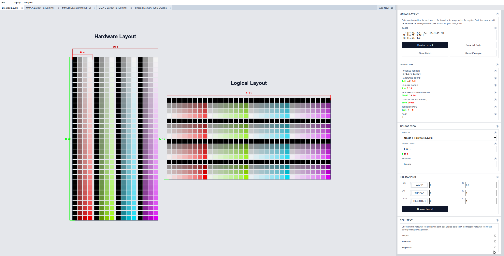

# linear-layout-viz



_Linear layout in Figure 1a of the linear layout paper visualized with the visualizer._

A visualizer for Triton linear layouts.
- [Website](https://deep-learning-profiling-tools.github.io/linear-layout-viz/)
- Paper: [Linear Layouts: Robust Code Generation of Efficient Tensor Computation Using F_2](https://arxiv.org/pdf/2505.23819)

See [MANUAL.md](./MANUAL.md) for the viewer interaction guide.
See [docs/sample-svgs/](./docs/sample-svgs/README.md) for example exported SVGs.

## Structure

- `tensor-viz/`: git submodule pointing at `Deep-Learning-Profiling-Tools/tensor-viz`

## Setup

```bash
git submodule update --init --recursive
cd tensor-viz
npm install
python -m venv .venv
source .venv/bin/activate
pip install -e .
npm run build
```

### One-time GitHub setup

1. Push this repo, including the submodule pointer you want Pages to build.
2. In GitHub, open `Settings -> Pages`.
3. Under `Build and deployment`, set `Source` to `GitHub Actions`.
4. Push to `main`, or run the `Deploy GitHub Pages` workflow manually from the Actions tab.

### Local preview of the same static site

```bash
cd tensor-viz
npm install
npm run build --workspace @tensor-viz/viewer-demo
```

The built site is written to `tensor-viz/packages/viewer-demo/dist`.

## Usage

- For day-to-day viewer usage, see [MANUAL.md](./MANUAL.md).
- The manual covers selection, inspector, matrix view, tabs, slicing, HSL coloring, cell text, display toggles, and saving SVG output.
- For example exports, see [docs/sample-svgs/](./docs/sample-svgs/README.md).
