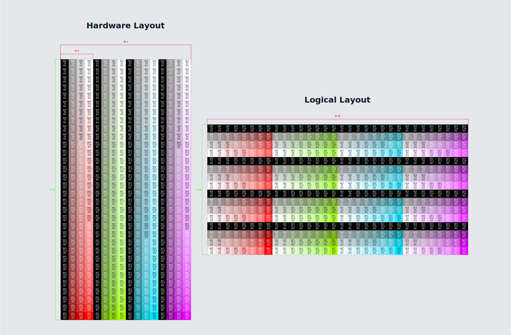
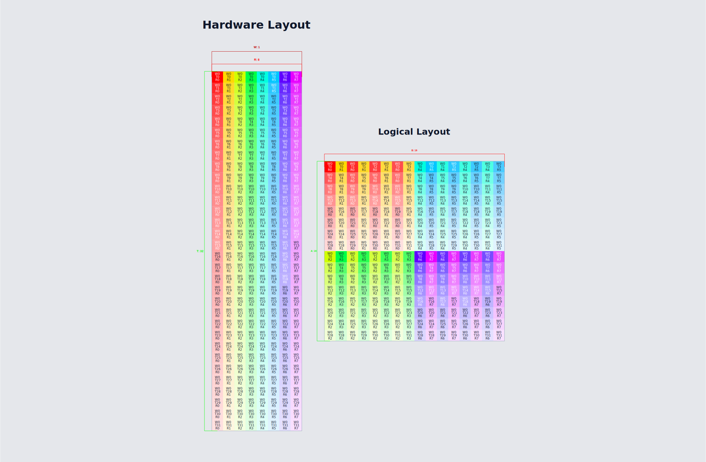
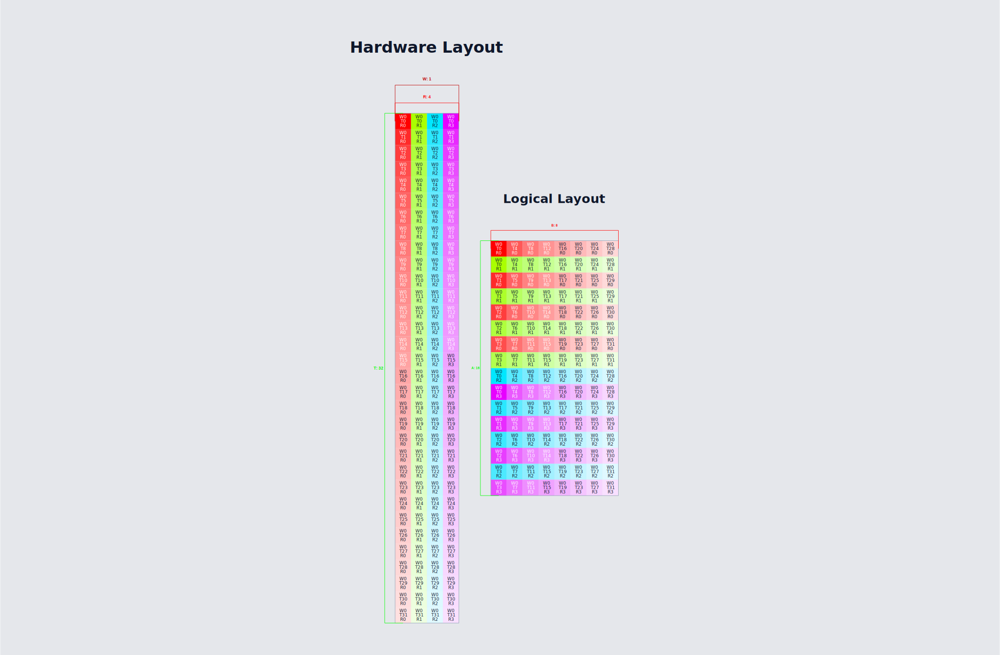
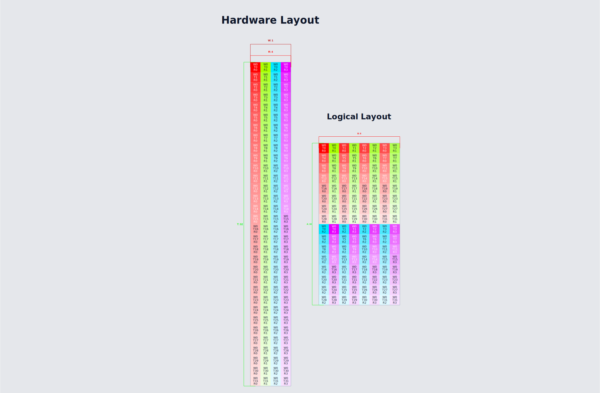
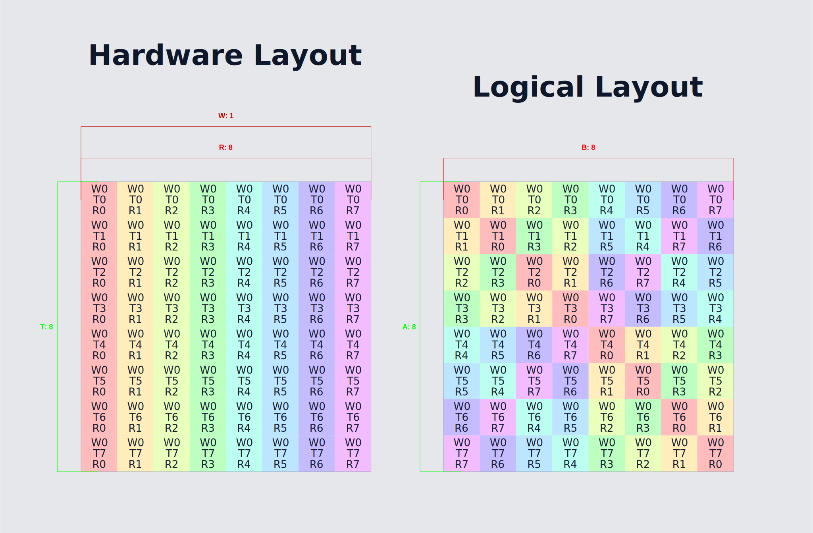

# Sample SVGs

This folder shows example SVG exports from the viewer.

For all examples:

- gaps off via `Display -> Toggle Block Gaps`
- `Cell Text`: warp id on, thread id on, register id on

## Blocked Layout

HSL settings:

- hue: warp `[0, 0.8]`
- saturation: thread `[0, 1]`
- lightness: register `[0, 1]`

## MMA A Layout (m16n8k16)

HSL settings:

- hue: register `[0, 0.8]`
- saturation: thread `[1, 0.25]`
- lightness: warp `[1, 1]`

## MMA B Layout (m16n8k16)

HSL settings:

- hue: register `[0, 0.8]`
- saturation: thread `[1, 0.25]`
- lightness: warp `[1, 1]`

## MMA C Layout (m16n8k16)

HSL settings:

- hue: register `[0, 0.8]`
- saturation: thread `[1, 0.25]`
- lightness: warp `[1, 1]`

## Shared Memory 128B Swizzle

HSL settings:

- hue: register `[0, 0.8]`
- saturation: warp `[0.5, 0.5]`
- lightness: thread `[1, 1]`

